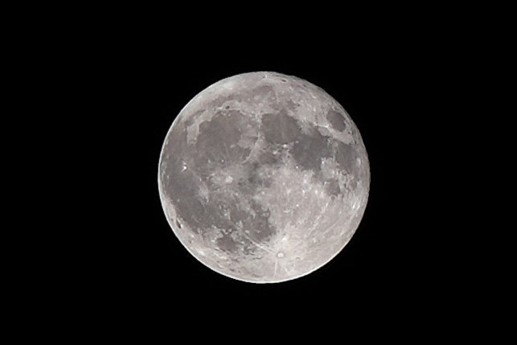

# moon-image-stacker
A Python tool that aligns, stacks, and sharpens multiple lunar images to enhance detail and reduce noise in astrophotography.


# Moon Image Stacker

## Repository Structure

```
moon-image-stacker/
├── README.md
├── requirements.txt
├── moon_stacker.py
├── examples/
│   ├── input/
│   │   ├── moon_image_1.jpg
│   │   ├── moon_image_2.jpg
│   │   └── ...
│   └── output/
│       ├── stacked_moon.jpg
│       └── sharpened_stacked_moon.jpg
└── LICENSE
```

## README.md Content

```markdown
# Moon Image Stacker

[](https://opensource.org/licenses/MIT)

Moon Image Stacker is a Python-based tool designed to enhance astrophotography images of the moon. It aligns and stacks multiple lunar images to reduce noise and increase detail, followed by an optional sharpening step for crisp, clear results.

## Features

- Image alignment using OpenCV feature matching
- Lucky imaging technique to select the best frames
- Median stacking for noise reduction
- Unsharp mask sharpening for enhanced details
- Easy-to-use command-line interface

## Installation

1. Clone this repository:
   ```
   git clone https://github.com/christine1729/moon-image-stacker.git
   cd moon-image-stacker
   ```

2. Install the required dependencies:
   ```
   pip install -r requirements.txt
   ```

## Usage

1. Place your moon images in the `examples/input/` directory.

2. Run the script:
   ```
   python moon_stacker.py
   ```

3. The script will generate two output images in the `examples/output/` directory:
   - `stacked_moon.jpg`: The result of aligning and stacking the input images
   - `sharpened_stacked_moon.jpg`: A sharpened version of the stacked image

## Customization

You can adjust the following parameters in `moon_stacker.py`:

- `lucky_imaging`: Change the percentile to select more or fewer frames
- `sharpen_image`: Modify the amount, radius, and threshold for different sharpening effects

## Contributing

Contributions are welcome! Please feel free to submit a Pull Request.

## License

This project is licensed under the MIT License - see the [LICENSE](LICENSE) file for details.

## Acknowledgements

- OpenCV for image processing capabilities
- NumPy for numerical operations

## Keywords

astrophotography, moon photography, image stacking, lunar imaging, astronomy, image processing, Python

```

## requirements.txt Content

```
opencv-python==4.5.5.64
numpy==1.21.5
```

## LICENSE Content

Use the MIT License text.
